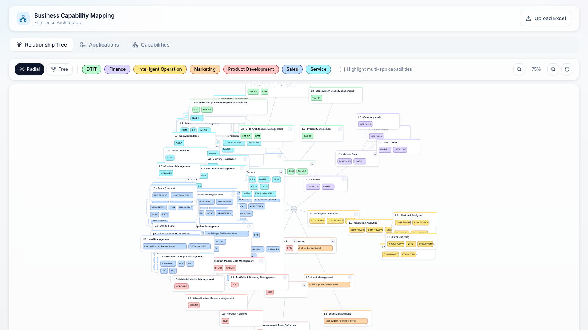

# Business Capability Application Mapping

企业业务能力与应用映射可视化工具 — 离线单文件静态应用，双击即可在浏览器中运行。



---

## 功能特性

- **关系树图**：以放射状（Radial）或树形（Tree）布局展示 L1 业务域 → L2 子域 → L3 能力 → 应用的完整映射关系
- **应用仪表盘**：查看所有应用的状态（Active / Planned）、归属域、关联能力
- **能力仪表盘**：查看各业务能力的应用覆盖率，按域分组展示
- **上传 Excel**：支持运行时上传新的 `.xlsx` 文件刷新数据（无需重新部署）
- **交互操作**：缩放、平移、拖拽节点、折叠/展开子树、按域过滤、高亮多应用能力
- **离线运行**：不依赖任何服务器或数据库，完全在浏览器本地运行

---

## 方式一：直接使用预构建单文件（推荐）

**无需安装任何依赖**，直接在浏览器打开 `dist/index.html`：

1. 下载或克隆本仓库
2. 找到 `dist/index.html` 文件
3. **双击** `dist/index.html`，或将其拖入浏览器窗口
4. 应用即刻加载，默认显示内置数据集

> **注意**：部分浏览器在 `file://` 协议下有安全限制。建议使用 Chrome 或 Edge 打开。

---

## 方式二：本地开发构建

### 环境要求

- [Node.js](https://nodejs.org/) >= 18
- npm（随 Node.js 一起安装）

### 安装依赖

```bash
npm install
```

### 启动开发服务器

```bash
npm run dev
```

浏览器访问 `http://localhost:5173`。

### 构建单文件

```bash
npm run build
```

构建完成后，`dist/index.html` 即为包含所有资源的单一 HTML 文件（约 600KB），可离线使用。

---

## Excel 数据格式

上传的 `.xlsx` 文件需包含以下必填列：

| 列名 | 说明 |
|------|------|
| `appId` | 应用唯一标识 |
| `appName` | 应用名称 |
| `appStatus` | 应用状态（Active / Planned 等）|
| `lv1Domain` | L1 业务域名称 |
| `lv2SubDomain` | L2 子域名称 |
| `bcId` | 业务能力 ID（如 `C6.1.3`）|
| `bcName` | 业务能力名称 |
| `parentBcId` | 父能力 ID（如 `C6.1`）|

其余列（`bcNameCn`、`bcDesc`、`geo`、`dataVersion` 等）为可选项。

---

## 技术栈

| 技术 | 用途 |
|------|------|
| React 18 + TypeScript | 前端框架 |
| Vite + vite-plugin-singlefile | 构建为单一 HTML 文件 |
| SheetJS (xlsx) | 浏览器端 Excel 解析 |
| Tailwind CSS 3 | 样式系统 |
| SVG | 树图可视化渲染 |
| localStorage | 节点位置持久化 |

---

## 项目结构

```
src/
├── components/
│   ├── tree-map/       # 关系树图核心组件
│   ├── dashboard/      # 应用与能力仪表盘
│   ├── layout/         # 页面布局（Header、导航栏）
│   ├── ui/             # 通用 UI 组件（Card、Badge、Button）
│   └── upload/         # Excel 上传组件
├── data/               # 数据解析与层级构建
├── hooks/              # 自定义 Hooks（hash 路由）
├── store/              # React Context 全局状态
├── types/              # TypeScript 类型定义
└── utils/              # 工具函数（几何计算、文本测量）
dist/
└── index.html          # 预构建单文件（可直接使用）
```

---

## License

MIT
